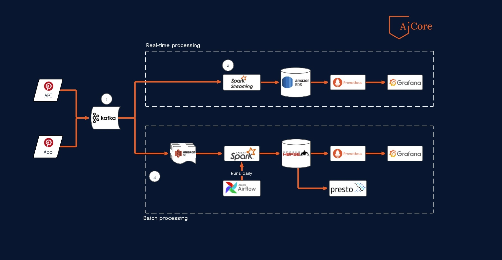

# Pinterest-data-processing-pipeline


## About the project

[](https://www.python.org/)

This project is part of the curriculum of the Data Engineering pathway of **AiCore**.  All the coding scripts were written in Python. The OS used is a Dual-Boot Ubuntu 20.04. The objective of this project is to build a data pipeline as shown in the figure below.



The data used during this project was obtained by scrapping the [Pinterest](https://www.pinterest.co.uk/ideas/) website (not part of this project but an example of the scrapper can be found at the following link: https://github.com/BlairMar/Pinterest-webscraping-project). The setup of the pipeline are as follows:

1. Before sending any data to Apache Kafka, Zookeeper and the Kafka Broker needs to be run first and then a Kafka topic can be created.
2. Data are  sent  to the Kafka topic by running both the ```project_pin_API.py``` (first) and ```user_posting_emulation.py``` (second) in the ```Pinterest_App``` folder (provided to students). The name of the topic should be changed in the first file if a different topic name is used.
3. The pipeline is then divided into 2 parts which are independent of each other and they are:
	* Real-time processing (all the scripts are in the ```Pinterest_Real_Time_Processing``` folder)
	* Batch processing (all the scripts are in the ```Pinterest_Batch_Processing``` folder)
4. Both sections process the same data (loaded from the same Kafka topic), but the first part processes data in real-time while the second part processes the data by scheduling using Apache Airflow.
5. Moreover, the database used to store the processed data  is different for each part as it is shown in the above diagram.
6. Prometheus is used to monitor the databases while Grafana is used to display graphs of what are being monitored (if applicable).


## Requirements
The Python libraries that are required for the pipeline to work are:
* apache-airflow
* boto3
* awscli 
* findspark
* fastapi
* kafka-python 
* uvicorn 
* pyspark
* happybase

Apart from these Python modules, some folders which contain important dependencies need to be downloaded. Some of the files also will need to be configured. For this project, the folders downloaded are:
* hadoop-2.10.1
* hbase-1.7.1
* kafka_2.13-3.0.0
* spark-3.2.1-bin-hadoop3.2

There are tutorials available online on how to configure each of the required files.
